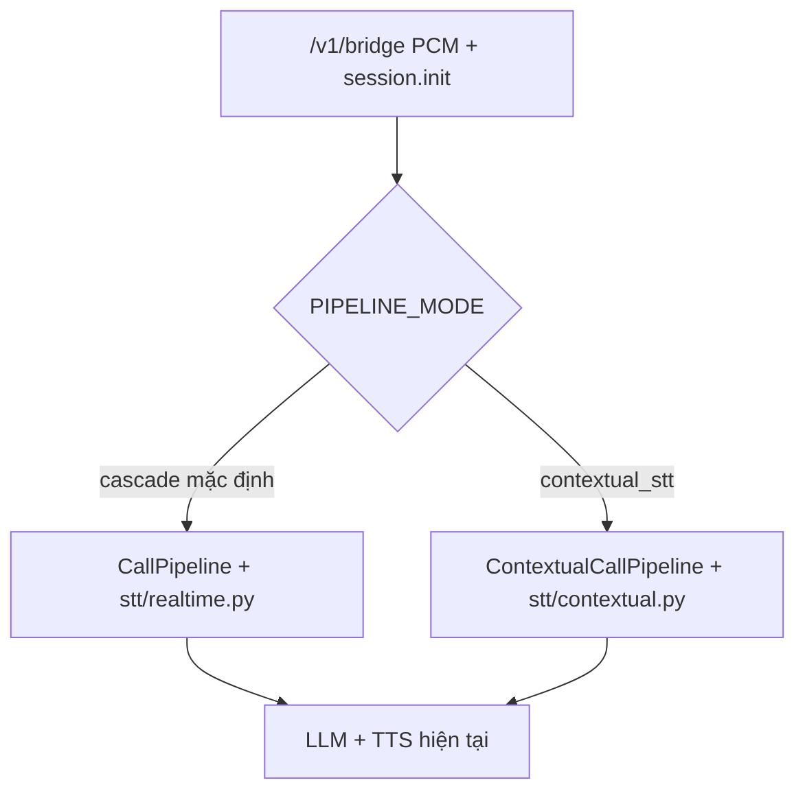

# Pipeline riêng: Contextual STT (Cách 2)

## 1. Bạn đang có gì, và Cách 2 khác chỗ nào

Hôm nay mỗi cuộc gọi đi **một đường duy nhất** (gọi là **cascade / pipeline hiện tại**):

```text
Micro → PCM 24 kHz → OpenAI Realtime STT (gpt-4o-mini-transcribe)
      → chuỗi chữ thô
      → Chat Completions (gpt-4o-mini, có menu/chi nhánh trong system prompt)
      → TTS → PCM phát lại
```

Điểm yếu: **STT không biết quán này bán gì**. Nó chỉ “nghe tiếng thành chữ”. Tên món, tên chi nhánh, từ chuyên ngành dễ bị viết sai. LLM ở bước sau **đã nhận chữ sai** rồi mới đọc catalog — đôi khi sửa được, đôi khi không (đúng nhược điểm Cách 1 trong [documents/so_sanh_kien_truc_nhan_dang_giong_noi.md](documents/so_sanh_kien_truc_nhan_dang_giong_noi.md)).

Cách 2 trong tài liệu đó: **đưa context vào chính lúc nghe**, không đợi LLM sửa chữ.

```text
Micro → PCM 24 kHz
      + prompt ("đây là cuộc gọi đặt món quán X")
      + keywords (Phở bò, Quận 3, ...)
      → OpenAI Realtime STT (gpt-live-transcribe)
      → chuỗi chữ đã được “gợi ý” đúng từ vựng
      → Chat Completions + TTS (giống pipeline cũ)
```

Đây **không** phải speech-to-speech (một model nghe rồi nói). Vẫn STT → LLM → TTS. Chỉ lớp **nhận dạng** được nhồi context.

## 2. Tách pipeline — không sửa luồng đang chạy

Yêu cầu: **đừng đụng pipeline hiện tại**.

Nghĩa là:

- Không sửa logic trong [stt/realtime.py](stt/realtime.py), [bridge/session.py](bridge/session.py), [order/tools.py](order/tools.py), [llm/stream.py](llm/stream.py).
- Không đổi default `OPENAI_STT_MODEL`.
- Cuộc gọi bình thường vẫn `CallPipeline` + `RealtimeTranscriptionClient` như hôm nay.
- Cách 2 sống ở **file mới** + một công tắc env.

Cùng một cửa WebSocket `/v1/bridge` (frontend/backend điện thoại không đổi). Process AI Bridge chọn pipeline lúc **tạo cuộc gọi**:

```text
PIPELINE_MODE=cascade            # mặc định — code cũ, không đổi hành vi
PIPELINE_MODE=contextual_stt     # pipeline Cách 2
```



Hai pipeline **không trộn giữa cuộc gọi**. Muốn so sánh: chạy process với env khác, hoặc restart với `PIPELINE_MODE=contextual_stt`.

Chỗ duy nhất của code cũ phải biết pipeline mới: [config.py](config.py), [.env.example](.env.example), và vài dòng factory trong [bridge/server.py](bridge/server.py). Không nhét `prompt`/`keywords` vào client STT cũ.

## 3. Vì sao không sửa `stt/realtime.py` tại chỗ

Nếu chỉ “thêm prompt vào file STT hiện tại”, mọi cuộc gọi production đổi hành vi ngay, khó rollback, khó A/B.

Tách client:

- [stt/realtime.py](stt/realtime.py) — giữ nguyên: `language: "en"`, không prompt, `gpt-4o-mini-transcribe`.
- [stt/contextual.py](stt/contextual.py) — **file mới**: cùng kiểu `start` / `append_pcm24` / `close` / `SttHandler`, nhưng session OpenAI có `prompt`, `keywords`, `languages`.

Pipeline mới **reuse** hàm parse event đã có (`transcript_from_event`, `_event_type`) — import, không copy-paste sửa file cũ.

`ContextualCallPipeline` **subclass** `CallPipeline` để khỏi nhân đôi greeting, DTMF, tool đặt bàn/món, barge-in. File [bridge/session.py](bridge/session.py) không bị sửa; class con nằm ở file mới và chỉ **override** vài móc.

## 4. Prompt khác keywords thế nào

OpenAI `gpt-live-transcribe` nhận ba thứ context. Không viết “hãy transcribe cho đúng” — họ bảo `prompt` là **bối cảnh cuộc ghi âm**, không phải lệnh.

**`prompt` (văn tự do, ngắn):**

> Phone call to the restaurant Pho 24. The caller may book a table or order pickup or delivery. Dish names may be Vietnamese.

**`keywords` (từng chuỗi literal, đúng như khách nói):**

`["Pho 24", "Quận 3", "Phở bò", "Bún chả", "Gỏi cuốn"]`

Keyword là **gợi ý**, không ép model bịa ra từ chưa được nói. Không nhồi UUID, giá, địa chỉ (người ta ít đọc nguyên địa chỉ; UUID thì không bao giờ).

**`languages`:** `["en", "vi"]` — khách có thể nói tiếng Anh xen tên món tiếng Việt. Model cũ dùng `language: "en"` (số ít); model mới **cấm gửi cả hai field**.

Giới hạn an toàn (OpenAI không công bố số cứng; vượt thì `session.update` bị reject):

- Prompt tối đa ~800 ký tự.
- Keywords tối đa ~80, mỗi cái một dòng, cấm `<`, `>`, xuống dòng.
- Ưu tiên: tên quán → tên chi nhánh → món của chi nhánh đang khóa.
- Update fail: log warning, **giữ session STT cũ**, cuộc gọi không chết.

## 5. Context lấy từ đâu, lúc nào (gà-trứng với menu)

Catalog nhà hàng load **sau** `session.init` ([bridge/session.py](bridge/session.py) `_load_catalog`). Menu còn muộn hơn: [order/tools.py](order/tools.py) `_ensure_menu` chỉ chạy khi LLM gọi `search_menu` / `list_menu`.

Nếu chỉ gắn keyword món **sau** lần search đầu, thì **câu khách nói món lần đầu** — đúng lúc cần nhận dạng — lại chưa có keyword.

Pipeline mới tự preload menu khi đã biết chi nhánh, **không sửa** `OrderTools`:

```text
t=0     WebSocket mở, STT contextual start
        prompt generic: "restaurant phone call"
        keywords: []

t=1     session.init (storeName, locale, toNumber)
        prompt có tên quán (nếu backend gửi storeName)
        keywords: [storeName]

t=2     _load_catalog xong (Redis/HTTP)
        keywords += tên chi nhánh
        nếu quán 1 chi nhánh → đã khóa sẵn

t=3     preload menu chi nhánh khóa (cùng cache/HTTP như OrderTools)
        ghi session.menu / menu_ready
        keywords += tên món
        session.update STT

t=4     khách nói "cho hai phở bò"
        STT đã có keyword "Phở bò" → transcript sạch hơn
        → LLM + tool như cascade cũ
```

Nếu nhiều chi nhánh và chưa khóa: lúc này chỉ có tên quán + tên chi nhánh (đủ để nhận “Quận 3”). Sau khi tool `lock_branch` / `select_branch` xong, pipeline mới preload menu và `update_context` lần nữa.

Không sửa `OrderTools`: sau mỗi `_run_reply` (override), nếu `session.menu` vừa có dữ liệu thì refresh STT. Đó là lưới an toàn khi preload miss.

## 6. Payload STT (pipeline mới)

Giữ PCM 24 kHz, `server_vad` như cũ (threshold 0.3, prefix 300 ms, silence 450 ms), `noise_reduction: None`. Khác ở khối `transcription`:

```python
{
  "type": "transcription",
  "audio": {
    "input": {
      "format": {"type": "audio/pcm", "rate": 24000},
      "transcription": {
        "model": "gpt-live-transcribe",
        "prompt": "Phone call to the restaurant Pho 24. ...",
        "keywords": ["Pho 24", "Quận 3", "Phở bò"],
        "languages": ["en", "vi"],
        "delay": "low",
      },
      "turn_detection": { ... VAD như hiện tại ... },
      "noise_reduction": None,
    }
  },
}
```

PCM vẫn `input_audio_buffer.append` liên tục. Không đợi hết câu mới transcribe. Khi catalog/menu đổi: `session.update` lại khối transcription; VAD không reset cuộc gọi.

## 7. Cây file — mới vs chạm nhẹ

```text
stt/realtime.py                 KHÔNG SỬA
bridge/session.py               KHÔNG SỬA
order/tools.py                  KHÔNG SỬA
llm/stream.py                   KHÔNG SỬA
frontend/                       KHÔNG SỬA

stt/context.py                  MỚI  build_stt_prompt / build_stt_keywords
stt/contextual.py               MỚI  ContextualTranscriptionClient
bridge/pipeline_contextual.py   MỚI  ContextualCallPipeline
tests/test_stt_context.py       MỚI
tests/test_contextual_pipeline.py MỚI

config.py                       SỬA NHẸ  pipeline_mode + env STT contextual
.env.example                    SỬA NHẸ  comment PIPELINE_MODE
bridge/server.py                SỬA NHẸ  if mode → factory pipeline/STT
```

**Reuse, không copy nghiệp vụ:** `CallSession`, `BookingTools`, `OrderTools`, `OpenAiLlm`, `OpenAiTts`, `OutboundGate`, `even_pcm16`, wire [bridge/protocol.py](bridge/protocol.py).

`ContextualCallPipeline` override tối thiểu:

- `_start_stt` — start client contextual (super gần như giữ nguyên nếu `self.stt` đã là client mới).
- `on_control` — `super()` rồi `update_context`.
- `_load_catalog` — `await super()._load_catalog()` rồi preload menu + `update_context`.
- `_run_reply` — `await super()._run_reply(...)` rồi refresh STT nếu menu/chi nhánh đổi.

## 8. Config (default không đổi hành vi)

```text
PIPELINE_MODE=cascade

# Chỉ có hiệu lực khi PIPELINE_MODE=contextual_stt
OPENAI_CONTEXTUAL_STT_MODEL=gpt-live-transcribe
OPENAI_STT_LANGUAGES=en,vi
```

`OPENAI_STT_MODEL=gpt-4o-mini-transcribe` **giữ nguyên** cho cascade. Test mặc định không import / không connect `ContextualTranscriptionClient`.

## 9. Test (pytest, không cần API key)

- `build_stt_keywords`: bỏ UUID, địa chỉ, ký tự cấm; cắt còn 80; ưu tiên món chi nhánh khóa.
- `build_stt_prompt`: có tên quán, không chứa “transcribe this audio”.
- Payload client mới: có `keywords` + `languages`, không có `language`.
- Pipeline contextual + FakeSTT: sau catalog giả, `update_context` được gọi với tên chi nhánh; sau menu giả, có tên món.
- `PIPELINE_MODE=cascade`: [tests/test_bridge_ws.py](tests/test_bridge_ws.py) và session cũ vẫn pass; server vẫn tạo `CallPipeline`.

## 10. Cố ý không làm trong lượt này

- Không S2S ([documents/s2s_pipeline.md](documents/s2s_pipeline.md)).
- Không LLM sửa transcript sau STT (Cách 1).
- Không đổi frontend / hợp đồng PCM.
- Không bỏ matcher chi nhánh/món.
- Không nhồi thực đơn mọi chi nhánh lúc init (chỉ chi nhánh đã khóa).
- Không đổi mặc định production.
