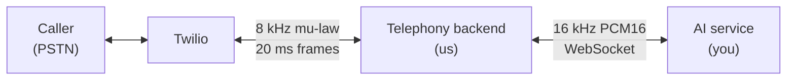

# AI Bridge — Integration Contract

**Status:** draft, pending your agreement
**Owners:** telephony backend team · AI team
**Last updated:** 2026-08-25

## What this is

We run an AI receptionist for restaurants. A customer dials the restaurant's
phone number, and our backend answers it over Twilio.

You are taking over the voice pipeline: speech-to-text, the language model,
text-to-speech, turn-taking, and the greeting. We keep the telephony — the phone
network, the codecs, and the audio framing.

This document is the contract between the two halves. It defines the transport,
the message shapes, the audio format, and the guarantees each side owes the
other. Both sides implement against it, and **if the code and this document ever
disagree, the document is what gets corrected** — you are building against it
and cannot see our codebase.

**We need three things back from you**, listed in full in
[§10](#10-open-questions):

1. The WebSocket URL and auth scheme
2. Confirmation of the frame encoding — binary audio, text control ([§2](#2-transport))
3. Answers on resume semantics, batch size, and transcripts

Items marked **[CONFIRM]** are proposals, not decisions. Push back on any of
them; they are written down so there is something concrete to disagree with.

> **Ready to build? Start at [§11](#11-getting-to-a-first-test).** It breaks the
> work into three milestones. The first needs no STT and no LLM, and is testable
> on a real phone call — you can be answering calls before your pipeline is
> finished.

---

## 1. Scope — who owns what



### The AI team owns

- Speech-to-text, including **voice activity detection**
- Language model / reasoning
- Text-to-speech
- **Turn-taking** — deciding when the caller has finished and when to reply
- **The greeting** — spoken at the start of the call
- Conversation state and history

### The backend owns

- Twilio telephony: the voice webhook, TwiML, and the Media Streams socket
- Codec conversion: mu-law ↔ PCM, 8 kHz ↔ 16 kHz resampling
- Framing: cutting audio into the exact 20 ms frames Twilio requires
- **Twilio's playback buffer** — including flushing it on barge-in
- Call records in the database

### Explicitly not the AI team's

- Anything Twilio-shaped. You never see mu-law, `streamSid`, or a 20 ms frame.
- Playback timing. Send audio as you produce it; the backend paces it.

### Explicitly not the backend's

- Any second VAD. See [§7](#7-why-the-interrupt-event-is-yours).

---

## 2. Transport

| | |
|---|---|
| Protocol | WebSocket (`wss://`) |
| Who dials | **The backend dials out** to the AI service |
| Sockets | **One per phone call**, opened when the call connects, closed when it ends |
| Auth | **[CONFIRM]** Bearer token in the `Authorization` header at handshake |
| URL | **[CONFIRM]** Supplied by the AI team; stored by the backend as `AI_BRIDGE_URL` |

### Frame types

The connection carries two kinds of WebSocket frame, and the frame type
distinguishes them. No envelope, no length prefix, no base64. **[CONFIRM]**

| WebSocket frame type | Carries |
|---|---|
| **Binary** | Raw audio bytes — 16 kHz PCM16 mono, little-endian |
| **Text** | A JSON control message (see [§4](#4-message-reference)) |

This is deliberate. Base64-in-JSON would add ~33% bandwidth and a decode step on
a path that carries ~32 KB/s per call in each direction. Every WebSocket library
exposes the frame type directly, so telling audio from control is a field check,
not parsing.

### Reconnection

- The backend reconnects with backoff on an unexpected close: **200 ms, 500 ms,
  1000 ms**, then gives up and lets the call continue without the agent.
- Caller audio arriving while the socket is down is buffered, capped at
  **~2 seconds**, oldest dropped first. See [§9](#9-failure-modes).
- A reconnect resends `session.init`, because the AI service has no other way to
  recover the store context — but with **`resumed: true`**.

  **`resumed` gates the greeting.** On the first connect it is `false` and you
  speak the greeting. On a reconnect it is `true` and you must **not** — a
  caller mid-conversation would not understand being greeted a second time.

- Beyond the greeting, the AI team should treat conversation state as lost
  unless `callId` is used to resume it. **[CONFIRM]** whether resume is
  supported, or whether a dropped socket ends the conversation.

---

## 3. Session lifecycle

```
Backend                                   AI service
   │                                          │
   ├── WebSocket connect ────────────────────►│
   │                                          │
   ├── {"event":"session.init", ...} ────────►│   text frame
   │                                          │
   │◄──────────── audio (greeting) ───────────┤   binary frames
   │                                          │
   ├── audio (caller) ───────────────────────►│   binary frames
   │◄──────────── audio (reply) ──────────────┤   binary frames
   │                                          │
   │◄──────────── {"event":"interrupt"} ──────┤   text frame, on barge-in
   │                                          │
   ├── WebSocket close ──────────────────────►│   caller hung up
```

1. **Open.** Backend connects when Twilio reports the call has started.
2. **Init.** Backend immediately sends `session.init` with the store context.
   Audio may begin flowing in either direction straight afterwards — the backend
   does not wait for an acknowledgement.
3. **Greeting.** The AI service speaks first, using the supplied greeting text.
4. **Conversation.** Audio flows both ways until the call ends.
5. **Close.** The backend closes the socket when the caller hangs up or Twilio
   ends the stream. The AI service should treat the close as final and release
   the session.

**If the AI service closes first**, the backend treats it as a failure, attempts
reconnection per [§2](#2-transport), and the caller hears silence until it
recovers. Avoid closing except on genuine error.

**If `session.init` is never processed**, the AI service should still accept
audio rather than erroring — but the greeting and store context will be missing,
which is a broken call. Log it loudly on both sides.

---

## 4. Message reference

### Backend → AI

#### `session.init` (text frame)

Sent once, immediately after the socket opens.

```json
{
  "event": "session.init",
  "callId": "clx8k2p9v0000abcd1234efgh",
  "storeName": "Bella Vista",
  "timezone": "Europe/Berlin",
  "locale": "en",
  "greeting": "Thanks for calling Bella Vista. This is an automated assistant — how can I help you today?",
  "resumed": false
}
```

| Field | Type | Notes |
|---|---|---|
| `callId` | string | Our internal call id. Use it for log correlation; it is the key we can cross-reference. |
| `storeName` | string | Restaurant name, for the prompt. |
| `timezone` | string | IANA zone, e.g. `Europe/Berlin`. Needed so "tonight" and "tomorrow" resolve against the store's clock, not the server's. |
| `locale` | `"en"` \| `"de"` | Language for this call. |
| `greeting` | string | Exact text to speak first. Configured per store; do not paraphrase — it carries a legally required automated-assistant disclosure. |
| `resumed` | boolean | `false` on the first connect — **speak the greeting**. `true` after a reconnect — **do not**. Every other field is resent unchanged either way. |

#### Audio (binary frame)

Caller audio. 16 kHz PCM16 mono, little-endian. ~100 ms per frame (3,200 bytes).
See [§5](#5-audio-format).

### AI → Backend

#### Audio (binary frame)

Agent audio. Same format. Any size — the backend reframes. Send as produced;
do not pace or pad.

#### `interrupt` (text frame)

```json
{ "event": "interrupt" }
```

Sent when your VAD detects the caller speaking while a reply is playing.
Requirements in [§6](#6-what-the-ai-team-must-ensure).

**[CONFIRM]** Do you want any other control messages? Candidates we have
deliberately *not* specified, because nothing currently needs them:
`response.start` / `response.end` (we no longer track turn state),
`transcript` (we persist no text — see [§10](#10-open-questions)).

---

## 5. Audio format

**Both directions: 16 kHz, PCM16 (signed 16-bit), mono, little-endian.**

No header, no container — raw sample data. A binary frame is a whole number of
samples; never split a sample across two frames.

| | Value |
|---|---|
| Sample rate | 16,000 Hz |
| Encoding | PCM16 signed, little-endian |
| Channels | 1 (mono) |
| Bytes per second | 32,000 |
| Backend → AI frame size | **[CONFIRM]** ~100 ms = 1,600 samples = **3,200 bytes** |
| AI → Backend frame size | Any. The backend reframes to Twilio's 20 ms. |

### On the 100 ms batch size

The backend batches caller audio into ~100 ms frames rather than sending each
20 ms Twilio frame individually — 50 tiny WebSocket messages per second per call
is needless overhead.

**But this lands directly in front of your VAD, and therefore in front of
barge-in responsiveness.** If 100 ms is too coarse, say so and we will lower it;
the cost on our side is only message overhead. **[CONFIRM]**

### A note on audio quality

The caller arrives over the PSTN as G.711 mu-law at 8 kHz. **There is no audio
content above 4 kHz** — the phone network does not carry it. The backend
upsamples to 16 kHz with an anti-aliased filter because you asked for 16 kHz
input, but this adds no information. Do not expect wideband speech, and do not
tune models on studio-quality 16 kHz audio and assume the results transfer.

The same applies in reverse: whatever you send is downsampled to 8 kHz and
mu-law encoded before it reaches the caller. Synthesising above 8 kHz is wasted
work at this end.

---

## 6. What the AI team must ensure

These are requirements, not suggestions. Each one has a specific failure mode.

### 6.1 Emit `interrupt` when the caller talks over the agent

The moment your VAD detects caller speech **while a reply is playing**, send
`{"event":"interrupt"}`.

*Why:* the backend cannot detect this. See [§7](#7-why-the-interrupt-event-is-yours).

*If you don't:* the agent talks over the caller for the remainder of the reply —
up to several seconds. The caller experiences it as the agent ignoring them.

### 6.2 Abort the in-flight response and send no further audio for it

On interrupt, stop generating and stop sending audio for the abandoned reply.

*If you don't:* the backend flushes Twilio's buffer on your `interrupt`, then
immediately refills it with the stale audio you are still streaming. The result
is worse than no barge-in at all — the reply stutters and resumes.

### 6.3 Send `interrupt` *after* the last audio frame of the aborted response

Ordering matters, and it is the detail that makes the simple implementation
correct.

WebSocket guarantees message ordering on a single connection. If `interrupt` is
the **last** thing sent for the abandoned turn, then everything arriving after it
unambiguously belongs to the new turn. The backend needs no turn IDs, no
sequence numbers, and no discard window.

*If you send it early* — before frames already queued in your writer — those
frames arrive after the backend has flushed, and get played as the start of the
"new" reply. This produces a call that sounds subtly broken in a way that is
very hard to trace from either side's logs.

### 6.4 Speak the greeting on `session.init` — unless `resumed` is true

Use the supplied `greeting` text and `locale`. Speak it verbatim.

*If you don't:* the call opens with silence, and the caller usually hangs up
within a few seconds. The greeting text also carries a required
automated-assistant disclosure, so paraphrasing it is a compliance problem, not
a style choice.

*And if you ignore `resumed`:* every mid-call socket drop re-greets the caller
in the middle of their conversation. The field exists precisely because the
context has to be resent on reconnect while the greeting must not be repeated.

### 6.5 Emit audio continuously enough not to starve playback

Once a reply starts, keep the backend supplied. A gap longer than your audio
lead time becomes an audible dropout mid-word.

You do **not** need to pace to real time — send faster than real time if you
can. The backend buffers and Twilio plays out at the correct rate.

---

## 7. Why the `interrupt` event is yours

This is the one requirement that looks like it could live on either side. It
cannot, and the reasoning is worth stating so it does not get relitigated.

**You already compute this signal.** "STT" is two components: a VAD that decides
"these bytes are human speech, not noise", and a transcriber. Your VAD is what
tells you the caller's turn has *ended* — that is how you know when to run the
model. That same VAD firing *while a reply is playing* **is** barge-in. It is the
identical signal, already inside your process. Emitting it is a `send()`, not a
feature.

**The backend cannot compute it.** The VAD moves to your service along with the
rest of speech-to-text. All the backend holds is raw audio bytes. A cough, a door
closing, a television, and "wait, actually—" are indistinguishable without a VAD.

**The backend must not rebuild one.** Two VADs means two sources of truth for
"is the caller talking", and they *will* disagree — the backend flushing on a
cough while you keep generating, or you aborting while the backend keeps
playing. That class of bug reproduces only on live calls and is miserable to
diagnose from either side.

**And only the backend can act on it.** Audio that has been handed to Twilio is
queued in Twilio's buffer and plays out regardless of what either of us does
next. The only thing that empties it is a `clear` message on the Twilio socket,
which only the backend holds.

So: **the knowledge is on your side, the actuator is on ours.** One message
bridges the gap.

### The concrete timeline

```
t=0.0s   You send 6 s of reply audio. Backend forwards it all to Twilio.
t=0.2s   Twilio has 6 s queued and starts playing. Both sockets now idle.
t=2.0s   Caller starts talking. Your VAD fires.
         You stop generating — but 4 s of audio is already in Twilio's buffer.
         ── without {"event":"interrupt"} ──
t=6.0s   Caller has heard the agent talk over them for 4 seconds.
```

---

## 8. Latency budget — what we measured

Handing this over so it is not rediscovered. These are the numbers from the
implementation this integration replaces, measured against live calls in August
2026.

| Stage | Measured |
|---|---|
| Server-VAD silence window before end-of-turn | 800 ms |
| `speech_stopped` → final transcript delivered | 300–600 ms |
| LLM: request → first **complete sentence** | 400–900 ms |
| TTS: request → first audio byte | 300–600 ms |
| **Total, caller's last word → first agent audio** | **~1.9–3.0 s** |

### What we learned

- **The VAD silence window dominates.** It was the single largest term. 800 ms
  was chosen because 500 ms split *"Hello, my name is Anna. Can I book a table
  for two people?"* into three separate turns at the comma pauses. Tuning this
  is the highest-leverage knob you have, and it trades directly against
  interrupting people who pause to think.

- **Chunk into TTS at sentence boundaries, not at the end of the completion.**
  Waiting for the full completion cost ~2.5 s to first audio; flushing the first
  sentence as soon as it was complete cost ~0.8 s, because TTS synthesises
  sentence one while the model is still writing sentence two. This was the single
  biggest win available and it is worth ~1.7 s.

- **Time-to-first-audio is the metric, not total completion time.** A reply that
  starts in 800 ms and takes 6 s to finish feels dramatically faster than one
  that starts in 2.5 s and finishes in 4 s.

- **Watch out for time-to-first-*sentence* vs time-to-first-token.** They are not
  the same number, and the gap is 15–25 tokens of generation.

- **Telephony audio decodes in chunkier bursts than studio audio.** Beware of
  tuning timeouts against fast-fed high-quality test files; a real call is paced
  at 20 ms and behaves differently.

---

## 9. Failure modes

| Situation | Backend behaviour | What we need from you |
|---|---|---|
| AI socket drops | Reconnect with 200/500/1000 ms backoff, then give up. Caller audio buffered, capped ~2 s, oldest dropped first. | Accept a fresh `session.init` on reconnect. **[CONFIRM]** resume semantics. |
| AI service slow to read | Backend caps its outbound queue and drops **oldest** audio first. | Nothing — but expect gaps in the caller audio you receive if you stall. |
| No audio from AI at all | Call stays open; caller hears silence. Logged as an error. | Send *something* — even an error message spoken aloud beats silence. |
| Malformed control message | Logged and ignored; the socket is **not** torn down. | Nothing. |
| Caller hangs up | Socket closed immediately. | Release the session; do not reconnect. |

The bounded-queue behaviour matters: **audio you receive may have gaps if you
stalled**, because stale audio transcribed late is worse than a missing word —
it arrives after the conversation has moved on.

---

## 10. Open questions

| # | Question | Owner | Status |
|---|---|---|---|
| 1 | Confirm binary-frames-for-audio / text-frames-for-JSON (§2) | AI team | Open |
| 2 | Confirm WebSocket URL and auth scheme (§2) | AI team | Open |
| 3 | Is conversation state resumable after a socket drop, keyed on `callId`? (§2) | AI team | Open |
| 4 | Is a ~100 ms input batch acceptable, given it sits in front of your VAD? (§5) | AI team | Open |
| 5 | Any additional control messages needed? (§4) | Both | Open |
| 6 | **Transcripts.** This contract is audio-only, so nothing records what was said. Our database already has the table for it, sitting empty. If transcripts are wanted for call review, analytics, or extracting booking details, say so — adding a `transcript` control message is cheap now and awkward later. | Both | Open |
| 7 | **Bookings.** The system was heading toward tool-calling to capture reservation details (name, party size, time). Who owns that now, and how does a completed booking reach our database? Not covered by this contract and it needs to be. | Both | Open |

---

## 11. Getting to a first test

Three milestones, each independently testable on a real phone call. Deliver them
in order and we can verify each as it lands, rather than debugging the whole
integration at once.

**Before any of them:** confirm the frame encoding in [§2](#2-transport). Every
milestone below assumes binary frames for audio and text frames for control. It
is the one open item that changes code on both sides.

### Milestone 1 — the greeting plays

**You build**

- Accept a `wss://` connection carrying `Authorization: Bearer <token>`
- Read the `session.init` text frame
- Speak `greeting` back as 16 kHz PCM16 mono LE **binary** frames

**We need from you:** the URL and a token. Nothing else.

**What it proves:** transport, auth, the handshake, store context, your TTS, and
our entire downsample → mu-law → 20 ms reframe → Twilio playback path. That is
most of the integration surface, and it needs **no STT and no LLM** — which is
why it is worth doing first rather than waiting for a complete service.

**Test:** call the number and hear the greeting.

### Milestone 2 — one full turn

**You build**

- Accept binary audio frames and run STT on them
- Run the model, synthesise, send reply audio back
- Honour `resumed: true` by *not* re-greeting

**What it proves:** the conversation works end to end, and reconnection does not
restart the call.

**Test:** call, ask a question, get a spoken answer. Then we drop the socket
mid-call and confirm you pick up without greeting again.

### Milestone 3 — barge-in

**You build**

- Emit `{"event":"interrupt"}` when your VAD fires during playback
- Send it **after** the last audio frame of the aborted response ([§6.3](#63-send-interrupt-after-the-last-audio-frame-of-the-aborted-response))
- Abort in-flight generation and send nothing further for that turn

**What it proves:** the hardest part, and the one that cannot be verified except
on a live call.

**Test:** talk over the agent mid-reply. It must stop within roughly one 20 ms
frame.

### What we can give you

- **A recording of real caller audio in exactly the form we send it** — 16 kHz
  PCM16, upsampled from a genuine 8 kHz PSTN call. Worth tuning your VAD and
  endpointing against this rather than studio-quality 16 kHz: telephony audio
  decodes in chunkier bursts, and thresholds tuned on clean input behave
  differently on a real line. See [§5](#5-audio-format) and
  [§8](#8-latency-budget--what-we-measured).
- **A stub of our side**, if it helps you develop before we are ready to call
  you — and we can run against a stub of yours. Neither team needs to block on
  the other to make progress.

---

## 12. What we need back from you

In rough priority order. The first two unblock everything else.

| | What | Why it blocks |
|---|---|---|
| 1 | **A `wss://` URL and a token**, even pointing at a stub that only accepts the connection | Without it we cannot test our half at all |
| 2 | **Confirm binary audio / text control** ([§2](#2-transport)) | The only open item that changes code on both sides |
| 3 | Answers to the rest of [§10](#10-open-questions) | Shapes the protocol, cheap to settle now |
| 4 | A view on the [§11](#11-getting-to-a-first-test) milestones — is that order workable for you? | Determines what we can test and when |

### On our side, ready now

- The telephony path is built and tested: Twilio webhook, media socket, mu-law
  codec, 8 ↔ 16 kHz resampling, 20 ms framing, and the `clear` that implements
  barge-in.
- The client that speaks this contract is written, with unit tests covering the
  handshake, batching, reconnection, and the `interrupt` path.
- We can point it at any endpoint that accepts a WebSocket. **Milestone 1 becomes
  testable the moment we have a URL** — even one that ignores our audio and plays
  a fixed greeting.

### Two things worth flagging before you start

- **Latency is the whole product.** [§8](#8-latency-budget--what-we-measured) is
  the budget we measured on the implementation you are replacing, including which
  knob dominated (the VAD silence window) and the single biggest win we found
  (chunking into TTS at sentence boundaries, worth ~1.7 s). Please read it before
  tuning anything — it will save you rediscovering the same numbers.

- **The `interrupt` event is the one requirement with no workaround.**
  [§7](#7-why-the-interrupt-event-is-yours) explains why it cannot live on our
  side. If it is genuinely not possible for you, tell us early — there is a
  fallback, but it costs audio quality and we would rather not.

### Reply to this document

Please respond with the answers inline, or as edits, rather than in chat — this
file is the reference both sides build from, and anything agreed elsewhere gets
lost. We will keep it updated as items are settled.
