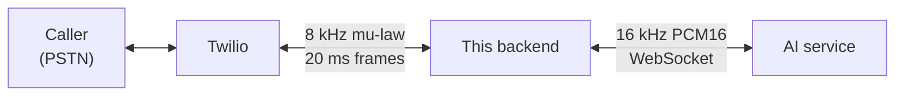

# Plan: AI Bridge — hand the voice pipeline to the AI team

- **Date:** 2026-08-25
- **Slug:** `ai-bridge`
- **Branch:** `feat/ai-bridge`
- **Status:** approved
- **Contract:** [ai-bridge-contract.md](ai-bridge-contract.md)
- **Change doc:** [../features/ai-bridge.md](../features/ai-bridge.md) — written after implementation

## Why we need this change

The AI team is taking ownership of the voice pipeline. They want **16 kHz PCM16
mono batches** as input and return **16 kHz PCM16 mono batches** as output,
handling speech-to-text, reasoning, synthesis, turn-taking, and the greeting
behind their own socket.

This repo therefore stops being an agent and becomes a **telephony ↔ AI media
bridge**: accept Twilio's 8 kHz mu-law, convert and batch it up to the AI team,
convert their PCM back into 20 ms mu-law frames, and hand those to Twilio.

Doing nothing means two teams building the same pipeline against the same
providers, and a boundary that nobody has written down.

### How we got here — a latency investigation that changed shape

This work began as an investigation into a 2–3 second delay between the caller
finishing a sentence and the agent replying. Two hypotheses were tested and both
were ruled out. They are recorded here because they will otherwise be
re-proposed.

**Ruled out: the 8 kHz → 24 kHz resampling.** Benchmarked at **87.8 µs per 20 ms
frame** — 0.44% of one core. It also runs *incrementally as frames arrive*
([openai-realtime-stt.service.ts:276-288](../../src/stt/openai-realtime-stt.service.ts#L276-L288)),
not as a batch after the caller stops speaking, so by the time they fall silent
every frame but the last is already converted and sent. Its contribution to
reply latency is **~0.09 ms**, or 0.003% of the observed delay.

**Ruled out: switching telephony vendor.** Twilio Media Streams is fixed at
`audio/x-mulaw` @ 8000 Hz. But an inbound PSTN call arrives at *any* vendor as
G.711 8 kHz — the ceiling is the phone network, not the carrier. Telnyx's L16 and
24 kHz options move the same upsample upstream without adding information, and
Agora is not a PSTN carrier at all (it reaches phone numbers only through a
partner SIP gateway, which adds a hop). A vendor swap changes latency by zero.

**The actual cause was the STT turn-detection chain** — roughly 1.1–1.4 s
elapsed between the caller falling silent and the language model being invoked
at all:

| Stage | Measured |
| --- | --- |
| Audio batching (5 frames per append) | ~100 ms |
| **Server-VAD silence window** | **800 ms** |
| **`speech_stopped` → `.completed` transcript** | **~300–600 ms** |
| LLM: first token *plus a complete first sentence* | ~400–900 ms |
| TTS: request → first audio byte | ~300–600 ms |

That code is being deleted by this plan, so the number becomes the AI team's to
own. The measurements are handed to them in
[§8 of the contract](ai-bridge-contract.md#8-latency-budget--what-we-measured)
rather than discarded.

## Goals

- A working audio bridge between Twilio and the AI team's WebSocket service.
- 16 kHz PCM16 mono in both directions, correctly resampled and gain-corrected.
- Barge-in that actually stops playback, driven by the AI team's `interrupt` event.
- A written, agreed contract the AI team can build against without seeing this repo.
- The repo left working at every commit.

## Non-goals

- **Fixing the reply latency.** It leaves with the pipeline. We hand over what we
  measured and stop there.
- **Changing telephony vendor.** Twilio stays. Ruled out above.
- **Transcript persistence.** The agreed contract is audio-only. See open questions.
- **Booking capture.** The tool-calling work Phase 4 was heading toward has no
  owner under this split. Out of scope here; flagged for a decision.

## Current behaviour

The backend owns the entire pipeline:

- [src/stt/](../../src/stt/) — an OpenAI realtime-transcription adapter over raw
  `ws`, with its own reconnection, bounded queue, batching, model-dialect
  profiles, and two endpointing strategies (server VAD, and a transcript-activity
  fallback for models that emit no turn boundaries).
- [src/llm/](../../src/llm/) — Chat Completions streaming, plus a
  [SentenceChunker](../../src/llm/sentence-chunker.ts) that cuts token deltas
  into speakable sentences so TTS can start before the completion finishes.
- [src/tts/](../../src/tts/) — synthesis to headerless PCM, downsampled and
  mu-law encoded, plus a pre-synthesised [greeting cache](../../src/tts/greeting-cache.ts).
- [call-session.ts](../../src/conversation/call-session.ts) — a
  `GREETING | LISTENING | THINKING | SPEAKING` state machine that ties them
  together, owns conversation history, and implements barge-in.

[src/telephony/](../../src/telephony/) and [src/audio/](../../src/audio/) sit
underneath and are provider-agnostic already.

## Proposed approach



A new `src/ai-bridge/` module owns one WebSocket per call. `CallSession` shrinks
to a pump: Twilio frames → mu-law decode → upsample → batch → AI team; AI team
PCM → downsample → mu-law encode → 20 ms reframe → Twilio.

The [`OutboundAudioSink`](../../src/conversation/audio-sink.ts) interface is
unchanged, so the gateway seam does not move.

### Decisions taken

| Decision | Choice |
| --- | --- |
| Audio format | 16 kHz PCM16 mono, little-endian, both directions. Requested by the AI team. |
| Transport | One WebSocket per call, backend dials out. Binary frames carry audio, text frames carry JSON control — no base64, no envelope. |
| Barge-in | The AI team sends `{"event":"interrupt"}`; we call `sink.clear()`. Their VAD is the only thing that knows; our socket is the only thing that can act. |
| Transcripts | None. Audio-only contract. `Utterance` stays in the schema but sits empty. |
| Greeting & store context | AI team, via a `session.init` handshake carrying `storeName`, `timezone`, `locale`, and the greeting text. |
| Sequencing | Build alongside, cut over, delete last. Never leave the repo non-functional. |

### Alternatives considered

| Option | Pros | Cons | Verdict |
| --- | --- | --- | --- |
| Keep the pipeline in-repo and fix latency | ~500–800 ms recoverable by lowering the VAD window and starting turns speculatively on `speech_stopped` | Duplicates the AI team's mandate; two teams own the same problem | **Rejected** — organisational, not technical |
| Self-paced outbound buffer instead of an `interrupt` event | No dependency on the AI team; we stay a pure pipe | Buffer depth becomes both jitter tolerance *and* barge-in overtalk. 200–400 ms of overtalk, and we own network jitter that Twilio absorbs today | **Fallback only** — see Risks |
| Send mu-law straight through, no resampling | Deletes [resampler.ts](../../src/audio/resampler.ts) entirely; 6× fewer bytes | AI team asked for 16 kHz. Saves ~0.09 ms | **Rejected** — not our call, and worth nothing |
| Switch to Telnyx or Agora | Telnyx is cheaper and supports `mark`/`clear`; both offer wideband codecs | Neither changes latency, and PSTN callers are 8 kHz regardless | **Deferred** — revisit on cost alone, separately |

## Implementation steps

0. [x] Create branch `feat/ai-bridge` off `master`.
1. [x] Write [the contract](ai-bridge-contract.md) and link it from [../README.md](../README.md).
2. [ ] New `src/ai-bridge/` module — `AiSession` interface plus a WebSocket client.
3. [ ] Retune [resampler.ts](../../src/audio/resampler.ts) for 8 kHz ↔ 16 kHz.
4. [ ] Reduce `CallSession` to a bridge; re-wire `ConversationService`. **Cutover.**
5. [ ] Delete `src/stt/`, `src/llm/`, `src/tts/` and their specs.
6. [ ] Schema decision on `Utterance`.
7. [ ] Repoint tests, replay harness, and dev client.

Commits 1–5 map one-to-one onto steps 1–5, each leaving the repo working.
Commit 4 is the cutover and must be verified on a live call before continuing.
**Commit 5 is a large pure deletion and should be raised as its own PR** — mixing
thousands of deleted lines into the review of the bridge logic hides the part
that needs eyes.

### Step 2 — `src/ai-bridge/`

Model the interface on [stt.provider.ts](../../src/stt/stt.provider.ts).
`pushAudio` plus callbacks is the right shape and is already proven against this
gateway.

```ts
AiSession:
  pushAudio(mulaw8k: Buffer): void
  onAudio(cb: (pcm16k: Buffer) => void): void
  onInterrupt(cb: () => void): void
  close(): Promise<void>
```

**Port the transport hardening from
[openai-realtime-stt.service.ts](../../src/stt/openai-realtime-stt.service.ts)
before deleting it.** That file already solved, against a live socket: a bounded
outbound queue with oldest-first drop, reconnect backoff (200/500/1000 ms),
buffering while the socket is still connecting, and a `bufferedAmount` cap for a
slow far end. Do not relearn these.

### Step 3 — Resampler at ratio 2

- `RATIO` becomes 2, derived from a configurable target rate rather than the
  hardcoded `OPENAI_SAMPLE_RATE` in [mulaw.codec.ts](../../src/audio/mulaw.codec.ts).
- Redesign the FIR at 16 kHz: `designLowPass(TAPS, CUTOFF_HZ, 16000)`.
  **48 taps remains correct.** Transition width is `(3.3/N) × fs`, so at 16 kHz
  it is ~1.1 kHz against ~1.65 kHz at 24 kHz — the filter gets *sharper* in Hz at
  the same tap count, putting the stopband fully in place below the 4 kHz Nyquist
  of the 8 kHz side.
- The `× RATIO` gain compensation in `Upsampler` scales with the ratio and so
  follows automatically, but **assert it in a test**. Getting it wrong feeds the
  AI team audio ~6 dB down; nothing throws, and it reads as a weak model rather
  than a resampler bug.
- Keep both directions stateful, one instance per call per direction. A filter
  restarted per frame rings audibly at every 20 ms boundary.

### Step 4 — `CallSession` as a bridge

- Delete `runTurn`, `history`, `handleFinal`, `mergeIntoLastUserMessage`, and the
  sentence/TTS loop.
- Keep `pushAudio`, the sink, `close()`, and `interrupt()` — the dev client's
  barge-in button drives the last one
  ([dev-client.controller.ts:81](../../src/dev/dev-client.controller.ts#L81)).
- Wire `onInterrupt` → `sink.clear()`. Nothing new is built;
  [bargeIn](../../src/conversation/call-session.ts#L382-L389) already does this.
- Inbound PCM → [FrameBuffer](../../src/audio/frame-buffer.ts) → `encodeMulaw` →
  `sink.playFrame`. `FrameBuffer` already guarantees whole 160-byte frames and
  pads the tail, which is what stops the last syllable clipping.
- **The `TurnState` machine mostly goes** — the AI team owns turn-taking. Keep
  `mark` / `onMarkPlayed` only if a "finished speaking" signal is still wanted
  for logging; it is no longer load-bearing.

## Files expected to change

**Deleted**

- `src/stt/` — 4 files (~1,100 lines) and specs
- `src/llm/` — 6 files, including the sentence chunker and the receptionist prompt
- `src/tts/` — synthesis, provider, module, greeting cache
- ~60% of `src/conversation/call-session.ts`

**Added**

- `src/ai-bridge/` — session interface, WebSocket client, module

**Modified**

- `src/conversation/conversation.service.ts` — inject the bridge, not stt/llm/tts/greetings
- `src/conversation/conversation.module.ts` — imports
- `src/audio/resampler.ts` and `src/audio/mulaw.codec.ts` — ratio 2
- `src/config/env.schema.ts` — new vars, remove obsolete model vars
- `test/harness/replay.ts`, `test/media-stream.e2e-spec.ts` — repoint at a fake `AiSession`

**Untouched**

- `src/telephony/` in full — webhook, TwiML, gateway, frame codec
- `src/conversation/audio-sink.ts`

## Data & configuration

- **New env vars:** `AI_BRIDGE_URL`, and an auth token — shape pending
  [contract §2](ai-bridge-contract.md#2-transport). Both validated in
  [env.schema.ts](../../src/config/env.schema.ts) so a missing value is a startup
  crash, not a 500 mid-call.
- **Removed env vars:** `STT_MODEL`, `LLM_MODEL`, `TTS_MODEL`, `TTS_VOICE`.
  `OPENAI_API_KEY` goes too, unless kept for the greeting — it is not, under the
  agreed contract.
- **Schema:** `Utterance` becomes unwritable. **Recommend leaving it in place**
  rather than migrating it away: if transcripts are added to the contract later
  the model and its relation are already correct, and an unused table costs
  nothing. `Call` rows are unaffected —
  [twilio.controller.ts](../../src/telephony/twilio.controller.ts) still owns
  creation and finalization.
- **Dependencies:** `openai` can be dropped. `ws` stays.

## Testing

1. `npm run lint` and `npm run build` before every commit.
2. `npm test` — the audio codec and resampler suites must stay green. They are
   now the highest-value tests in the repo.
3. New unit test: `Upsampler` at ratio 2 preserves amplitude. Guards the gain bug.
4. New unit test: stopband attenuation at 4 kHz after the FIR redesign.
5. Bridge tests replacing the turn-machine cases in
   [call-session.spec.ts](../../src/conversation/call-session.spec.ts) — audio in
   → batched out; PCM in → 160-byte mu-law frames out; `interrupt` → `clear()`.
6. Replay harness end-to-end against a fake AI session, asserting `clear()` fires
   on `interrupt`.
7. **Live call** via `npm run start:dev` and the dev client:
   - the greeting plays — proves `session.init` carried store context
   - speech is understood — proves the 16 kHz conversion *and gain* are right; a
     gain bug shows up as poor recognition, not silence
   - talking over the agent stops it within ~1 frame — proves `interrupt` → `clear`
   - no clicks at 20 ms boundaries — clicks mean FIR state is being reset per frame

## Risks & rollback

**The `interrupt` contract is a hard dependency on the AI team.** If they will
not send it, barge-in cannot work as designed, because audio handed to Twilio
plays out of Twilio's buffer regardless of what either side does next.

*Fallback:* pace outbound audio ourselves — release one 20 ms frame every 20 ms
with a small jitter buffer, so Twilio never queues more than that. Buffer depth
then equals both jitter tolerance and barge-in overtalk; 200–400 ms is the
workable range. **Do not build this unless they decline.**

**Cutover risk.** Commit 4 switches the live path. Rollback is `git revert` of
that single commit — the old modules are still present until commit 5, which is
the whole reason for the ordering.

**Gain and resampling errors are silent.** Nothing throws; transcription just
gets quietly worse. Covered by tests 3, 4 and the live check in 7.

## Open questions

- Seven items are tracked in
  [contract §10](ai-bridge-contract.md#10-open-questions), each with an owner.
- **Transcripts** — audio-only means no conversation record. Cheap to add now,
  awkward later. *Owner: both teams.*
- **Bookings** — the reservation capture Phase 4 was heading toward is unowned
  under this split. *Owner: both teams.*
