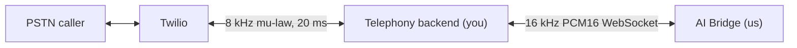

# AI Bridge — what this service does for you

**Status:** delivered, v1 audio path
**Owner:** team AI
**Audience:** team backend (telephony)
**Last updated:** 2026-08-26
**Implements:** [AI Bridge contract](../backend_contract/ai-bridge-contract.md)

The contract says what we agreed to build. This document says what we actually
built, so you can integrate against the running service instead of against the
promise. Where the two differ, [§8](#8-things-you-should-know) lists it.

Our internal design is in [ai-pipeline.md](../ai-pipeline.md). You should not
need it.

---

## 1. What this service is

One WebSocket per call. You dial us, you push caller audio in, we push agent
audio back. That is the whole surface.



You never see OpenAI, sample-rate conversion, voice activity detection, turn
state, or LLM history. We never see Twilio, mu-law, `streamSid`, or 20 ms
frames. That separation is deliberate and we have not leaked across it.

We own: speech-to-text including VAD, turn-taking, the greeting, the language
model, conversation history, and text-to-speech.

You own: Twilio, codec conversion, 20 ms framing, playback pacing, the Twilio
playback buffer (including flushing it on barge-in), and any call records in
your database.

---

## 2. What you connect to

| | |
|---|---|
| URL | `wss://<host>/v1/bridge` — store as `AI_BRIDGE_URL` |
| Auth | `Authorization: Bearer <token>` on the handshake |
| Socket | One per call. Open when the call connects, close when it ends. |
| Health | `GET /health` → `{"status":"ok"}` |

Use `/health` for readiness and load-balancer checks. It does not touch OpenAI,
so a healthy response means the process is up, not that speech services are
reachable.

If the token is missing or wrong we close with **1008 `Unauthorized`** before
accepting the socket. If our pipeline crashes mid-call we close with
**1011 `Internal error`**. We close for no other reason — a socket that stays
open is a call we are still serving.

---

## 3. What crosses the wire

Two frame kinds each direction. The WebSocket frame type distinguishes them.
No envelope, no length prefix, no base64.

| Direction | Frame | Payload |
|---|---|---|
| You → us | Text | JSON `session.init` |
| You → us | Binary | Caller audio, PCM16 LE mono 16 kHz |
| Us → you | Binary | Agent audio, same format |
| Us → you | Text | `{"event":"interrupt"}` on barge-in |

**Audio format, both directions:** 16.000 Hz, signed PCM16, little-endian,
mono, no header, 32.000 bytes per second.

**Inbound sizing.** The contract specifies ~100 ms / 3.200-byte frames and that
is what we expect, but we do not enforce it — send any size and we will handle
it, including a frame that ends on an odd byte (we hold the stray byte and
prepend it to your next frame rather than dropping it). You do not need to
align to sample boundaries for us, though the contract still asks you to.

**Outbound sizing.** Arbitrary, and it varies with the speech synthesizer's
chunking. Every frame we send is a whole number of samples — we never split a
16-bit sample across two frames. Re-frame to your 20 ms as you like.

**`session.init`** — send once, immediately after the socket opens. We send no
acknowledgement; start streaming audio right away.

```json
{
  "event": "session.init",
  "callId": "clx8k2p9v0000abcd1234efgh",
  "storeName": "Bella Vista",
  "timezone": "Europe/Berlin",
  "locale": "en",
  "greeting": "Thanks for calling Bella Vista. This is an automated assistant — how can I help you today?"
}
```

All five fields are read. `timezone` must be an IANA zone — it is what makes
"tonight" and "tomorrow" resolve against the restaurant's clock rather than our
server's; an unparseable zone falls back to UTC and is logged. `locale` sets the
transcription language and the wording of our error fallback line. `callId` is
used for log correlation only.

A second `session.init` on the same socket is ignored with a warning. Any control
event we do not recognise is logged and ignored.

---

## 4. What we guarantee

These are the five commitments from contract §6, stated as what the service
does, with the part that matters to you.

**The greeting is spoken verbatim.** On `session.init` we send your `greeting`
string straight to speech synthesis. It does not pass through the language
model and is never reworded. The mandatory automated-assistant disclosure your
greeting carries arrives intact — that is a compliance property, not a stylistic
one.

**We tell you when the caller talks over the agent.** The moment our VAD detects
caller speech while we are playing a reply, we send `{"event":"interrupt"}`.
You cannot compute this signal — VAD left your side along with the speech
recogniser — and you should not rebuild one. Two VADs means two sources of truth
that will disagree on live calls.

**We stop sending audio from an interrupted turn.** Once a turn is abandoned, not
one more byte of it reaches you, including frames already queued internally.
Nothing you flush will be refilled with stale audio.

**`interrupt` always arrives after the last audio frame of the turn it cancels.**
This is the ordering guarantee, and it is the one that keeps your side simple.
Because WebSocket preserves message order and `interrupt` is the *last* thing we
send for an abandoned turn, everything that arrives after it belongs to the new
turn. Unambiguously. You need no turn IDs, no sequence numbers, and no discard
window: flush on `interrupt`, play whatever comes next.

**We send audio as fast as we generate it.** No pacing, no padding. Once a reply
starts we keep audio flowing so your buffer does not run dry mid-word. You pace
playback; we do not try to help.

---

## 5. What we do not do

Do not wait for any of these — none are on this socket in v1.

- **No transcript.** Conversation text lives in our memory for the language
  model and is never sent to you. If you need it for review or analytics, that
  is a new control message and a contract change; cheap now, awkward later.
- **No booking, no tool calls, no database access.** Our entire context is
  `session.init` plus in-memory history.
- **No resume after a socket drop.** Reconnect starts a new session: send a
  fresh `session.init`, and history is empty — the agent greets again and will
  not remember the conversation. `callId` does not key anything on our side.
- **No control messages other than `interrupt`.** No `response.start`,
  `response.end`, `transcript`, or `transfer`.
- **Nothing Twilio-shaped.** We have no concept of mu-law, `streamSid`, 20 ms
  frames, or your playback buffer.

---

## 6. How we behave when things break

| Situation | What we do | What you should do |
|---|---|---|
| Malformed control JSON | Log it, ignore it. **Socket stays open.** | Nothing. We will not cut the call over a bad frame. |
| Audio arrives before `session.init` | Accept it and log loudly. Socket stays open. | Fix the ordering — without the greeting and store context the call is degraded, but it will not fail hard. |
| Empty or failed transcription | Speak a fallback line in the call's locale. | Nothing. |
| Language model or synthesis failure | Speak the same fallback line. Socket stays open. | Nothing. We would rather say something than go silent. |
| We fall behind reading your audio | Buffer caller audio, cap ~2 s, oldest dropped first. | Expect gaps in what we transcribed. Stale audio transcribed late is worse than a missing word. |
| Caller hangs up | You close; we release the session and the speech connection. | Close the socket. Do not reconnect. |
| Our socket dies unexpectedly | — | Reconnect with your 200/500/1000 ms backoff, then give up and run the call agentless. Send a new `session.init`. |

The rule underneath the table: **we do not answer silence with silence.** If a
turn is owed to the caller, something gets spoken, even if it is an apology.

---

## 7. Latency you should expect

Measured on real calls, matching the budget in contract §8.

| Stage | Measured |
|---|---|
| VAD silence window before end-of-turn | 800 ms |
| End of speech → final transcript | 300–600 ms |
| Language model → first complete sentence | 400–900 ms |
| Synthesis → first audio byte | 300–600 ms |
| **Caller stops speaking → first agent audio** | **~1,9–3,0 s** |

Two things worth internalising:

The **800 ms silence window is the single largest term**, and it is a deliberate
choice, not slack. At 500 ms, *"Hello, my name is Anna. Can I book a table for
two people?"* was split into three separate turns at the comma pauses. Tuning
this trades directly against interrupting callers who pause to think.

**The metric is time-to-first-audio, not time-to-complete.** A reply that starts
at 800 ms and takes 6 s to finish sounds markedly faster than one that starts at
2,5 s and finishes at 4 s. We synthesize sentence by sentence rather than waiting
for the full completion, which is where roughly 1,7 s of the original budget
went.

Your 100 ms input batching sits in front of our VAD and therefore adds up to
~100 ms to barge-in detection. We accept that. Do not shrink it unless real
calls show it is the bottleneck.

---

## 8. Things you should know

Three places where the running service differs from a literal reading of the
contract. None break compatibility; all three are worth knowing before you debug
something at 2 a.m.

**We accept a `?token=` query parameter as well as the `Authorization` header.**
See [bridge/server.py:23-30](../../bridge/server.py#L23-L30). This exists because
browsers cannot set headers on a WebSocket, and we ship a browser demo for manual
testing. **Keep using the header.** Be aware that if anything on your side ever
falls back to the query form, the token will be written to proxy logs, access
logs, and browser history.

**`interrupt` can arrive before we have sent any audio for that turn.** If the
caller speaks again while we are still generating a reply — after the transcript
landed but before the first audio frame went out — we send `interrupt` anyway.
See [bridge/session.py:363-374](../../bridge/session.py#L363-L374). You will flush
a Twilio buffer that is already empty, which is a no-op. **Do not treat this as a
protocol violation or log it as an error.** The ordering guarantee in
[§4](#4-what-we-guarantee) still holds: whatever follows belongs to the new turn.

**`wss://` requires a TLS terminator in front of us.** The process itself serves
plain HTTP and WebSocket. Terminate TLS at your ingress, load balancer, or
reverse proxy — do not point `AI_BRIDGE_URL` at the service port directly in
production.

---

## 9. Quick reference

```
connect   wss://<host>/v1/bridge      Authorization: Bearer <AI_BRIDGE_TOKEN>
health    GET /health                 {"status":"ok"}

you  →  us    text    {"event":"session.init", callId, storeName, timezone, locale, greeting}
you  →  us    binary  caller PCM16 LE mono 16 kHz, ~100 ms / 3.200 bytes
us   →  you   binary  agent PCM16 LE mono 16 kHz, arbitrary size, whole samples
us   →  you   text    {"event":"interrupt"}        ← flush your Twilio buffer

close 1008    bad or missing token
close 1011    our pipeline crashed
```

---

## Related

- [AI Bridge contract](../backend_contract/ai-bridge-contract.md) — the wire
  protocol both sides implement. §10 records the v1 [CONFIRM] answers.
- [AI voice pipeline](../ai-pipeline.md) — our internal design: speech
  recognition, language model, synthesis, resampling, and barge-in ordering.
  Reference only; nothing in it changes the wire.
