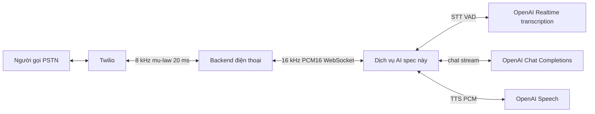
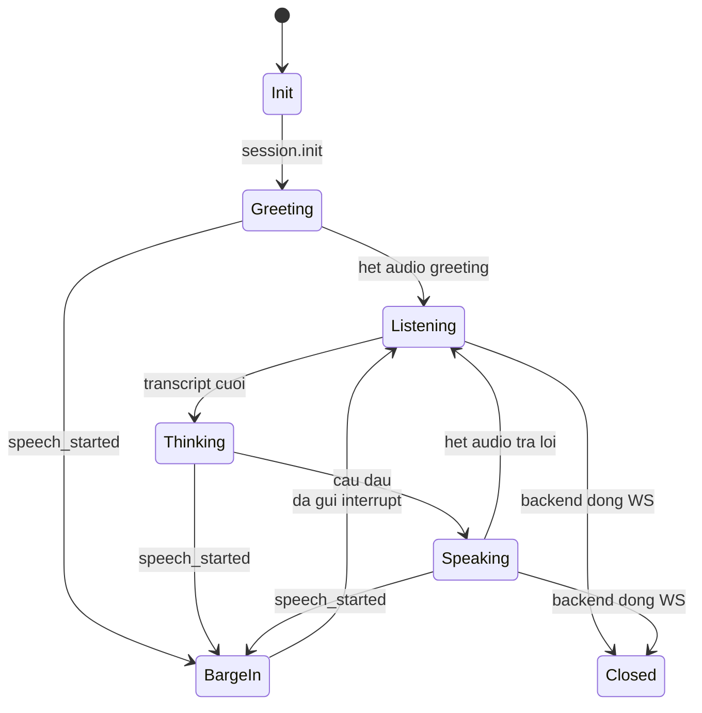

# Pipeline giọng nói AI — PCM vào → STT → LLM → TTS → PCM ra

**Trạng thái:** spec team AI, đường audio v1
**Chủ sở hữu:** team AI
**Cập nhật lần cuối:** 2026-08-25
**Implement:** [Hợp đồng AI Bridge](backend_contract/ai-bridge-contract.md)

Tài liệu này là thiết kế dịch vụ AI. Backend điện thoại không thấy OpenAI,
resample, trạng thái lượt nói, hay lịch sử LLM. Họ chỉ thấy WebSocket mô tả
trong hợp đồng: PCM nhị phân hai chiều, `session.init`, và `interrupt`.

v1 chỉ sở hữu **audio vào → audio ra**. Tool đặt bàn và database là hook
về sau, không thuộc đường này.

---

## 1. Phạm vi

Backend điện thoại gọi tới dịch vụ này. Một WebSocket cho mỗi cuộc gọi.




Dịch vụ này sở hữu:

- Speech-to-text, gồm cả VAD / chia lượt nói
- Câu chào, đọc nguyên văn từ `session.init`
- LLM + lịch sử hội thoại trong RAM
- TTS
- Đổi định dạng giữa bridge (PCM16 16 kHz) và OpenAI (PCM16 24 kHz)
- Gửi `interrupt` khi barge-in, đúng thứ tự hợp đồng §6.3

Dịch vụ này **không** sở hữu:

- Twilio, mu-law, `streamSid`, cắt frame 20 ms, hay nhịp phát lại
- Bản ghi cuộc gọi trong database backend
- Đặt bàn ở v1 (xem [§10](#10-hoãn-lại--hook-công-cụ))

Hình dạng pipeline: **cascaded** (nối tầng). Realtime API chỉ dùng cho
**STT + VAD**. LLM và TTS là HTTP riêng. Không dùng Realtime speech-to-speech.

---


## 2. Ánh xạ wire

```
Khớp hợp đồng từng byte. JSON/base64 nội bộ của OpenAI không xuất hiện
trên socket này.
```


| Hướng        | Frame WebSocket | Payload                                                        |
| ------------ | --------------- | -------------------------------------------------------------- |
| Backend → AI | Text            | JSON `session.init`                                            |
| Backend → AI | Binary          | Audio người gọi, PCM16 LE mono 16 kHz, ~100 ms / 3.200 byte    |
| AI → Backend | Binary          | Audio agent, cùng định dạng, kích thước tùy ý miễn trọn sample |
| AI → Backend | Text            | `{"event":"interrupt"}` khi barge-in                           |


Auth: token Bearer trong header `Authorization` lúc handshake.

URL backend lưu là `AI_BRIDGE_URL`: `wss://<host>/v1/bridge`
(placeholder cho đến khi host AI được deploy).

v1 **không** resume sau khi socket đứt. Reconnect là session mới:
`session.init` mới, history rỗng. `callId` chỉ để log.

Nếu PCM tới trước `session.init`: vẫn nhận và log thật to. Thiếu câu chào
và context cửa hàng; **không** đóng socket.

Không đóng socket trước trừ khi process thật sự lỗi. Backend đóng = cuộc
gọi kết thúc; giải phóng session và kết nối OpenAI Realtime.

---


## 3. Đổi audio

Có hai sample rate. Chúng không được lẫn sang phía bên kia.


| Chặng                            | Rate      | Encoding                                                                    |
| -------------------------------- | --------- | --------------------------------------------------------------------------- |
| Bridge (cả hai chiều)            | 16.000 Hz | PCM16 signed, little-endian, mono, không header                             |
| Input STT OpenAI Realtime        | 24.000 Hz | PCM16 signed, little-endian, mono, base64 trong `input_audio_buffer.append` |
| OpenAI TTS `response_format=pcm` | 24.000 Hz | PCM16 signed, little-endian, mono, không header                             |


Audio người gọi:

1. Nhận frame nhị phân 16 kHz.
2. Upsample 16 kHz → 24 kHz bằng bộ lọc chống alias.
3. Encode base64 rồi `input_audio_buffer.append` lên Realtime. Base64 đó
  là wire của OpenAI, không phải bridge.

Audio agent:

1. Nhận PCM 24 kHz từ TTS (stream).
2. Downsample 24 kHz → 16 kHz bằng bộ lọc chống alias.
3. Gửi frame nhị phân về backend. Không bao giờ cắt một sample 16-bit
  xuyên hai frame. Không pace, không pad; gửi ngay khi có.

PSTN không có nội dung trên 4 kHz. Upsample lên 24 kHz cho OpenAI **không**
thêm thông tin giọng nói; chỉ để thỏa yêu cầu input Realtime.

---


## 4. Session và câu chào

Một object session cho mỗi WebSocket. Field từ `session.init`:

- `callId`, `storeName`, `timezone`, `locale`, `greeting`

Lịch sử LLM lúc bắt đầu:

1. System: locale, tên cửa hàng, múi giờ IANA, “nói tự nhiên, ngắn, không
  markdown”. “Tối nay” / “ngày mai” tính theo `timezone`, không theo đồng
   hồ server.
2. Assistant: chuỗi `greeting` **nguyên văn**. Không diễn lại. Câu này
  mang disclosure bắt buộc về trợ lý tự động.

Khi nhận `session.init`, đưa `greeting` qua cùng đường TTS như các câu
trả lời sau. Đặt `playing = true` cho đến khi gửi xong audio chào, hoặc
bị barge-in.

`generation_id` bắt đầu từ 0. Tăng khi bắt đầu greeting hoặc câu trả lời,
và mỗi lần barge-in. Mọi LLM/TTS đang chạy mà id không còn khớp phải
ngừng gửi.

---


## 5. STT — OpenAI Realtime, chỉ transcription

Mở **một** kết nối Realtime cho mỗi cuộc gọi. Kiểu session:
**transcription**. Model không được nói.


| Thiết lập             | Giá trị v1               |
| --------------------- | ------------------------ |
| Model                 | `gpt-4o-mini-transcribe` |
| Input format          | PCM16 24 kHz mono        |
| Turn detection        | `server_vad`             |
| `silence_duration_ms` | **800**                  |
| `prefix_padding_ms`   | 300                      |
| `threshold`           | 0.5                      |


800 ms là cửa sổ im lặng đã đo ở hợp đồng §8. 500 ms từng cắt một câu
thành nhiều lượt ở chỗ ngắt hơi dấu phẩy.

Sự kiện dịch vụ này xử lý:


| Sự kiện                     | Việc làm                                                                        |
| --------------------------- | ------------------------------------------------------------------------------- |
| `speech_started`            | Nếu đang greeting, thinking, hoặc speaking: barge-in. Nếu đã listening: bỏ qua. |
| `speech_stopped`            | Hết audio người gọi cho lượt này. Chờ transcript completed rồi mới LLM.         |
| transcription **completed** | Text cuối của user → LLM.                                                       |
| transcription **delta**     | Chỉ log / debug. Không bao giờ chạy LLM trên bản partial.                       |


Chuyển mọi frame người gọi vào Realtime ngay sau khi resample. Không chờ
hết nói mới bắt đầu transcribe.

### Fallback nếu model transcription không có VAD

`gpt-live-transcribe` (và tương tự) có thể bắt `turn_detection: null`.
Khi đó, theo thứ tự:

1. Silero VAD local + `input_audio_buffer.commit` tường minh, hoặc
2. Session Realtime với `create_response: false` và input transcription,
  để nhận sự kiện VAD mà model không nói.

**Không** fallback sang speech-to-speech full duplex.

---


## 6. Barge-in

`speech_started` khi `playing` là true, hoặc khi LLM/TTS đang chạy, chính
là barge-in. Cùng một VAD với hết-lượt-nói; backend không tính được tín
hiệu này.

Thứ tự bắt buộc:

1. Tăng `generation_id`. Mọi LLM/TTS cũ thành stale.
2. Hủy LLM stream và mọi HTTP TTS đang bay.
3. **Không gửi** thêm audio nào của lượt bỏ — kể cả frame còn nằm queue
  local chưa `send()`.
4. Gửi `{"event":"interrupt"}` **sau** frame audio nhị phân cuối **đã gửi**
  của lượt đó.
5. Tiếp tục append PCM người gọi vào STT. Đoạn nói này là lượt user mới.

Nếu gửi `interrupt` khi audio còn kẹt trong writer WebSocket, các frame đó
tới sau khi backend đã flush Twilio và bị phát như đầu câu “mới”
(hợp đồng §6.3).

---


## 7. LLM — sau transcript cuối

Khi transcription **completed** tới (người gọi nói xong):

1. Text rỗng: TTS câu fallback đúng locale (“xin nói lại”). Không đóng
  socket. Không im lặng.
2. Không rỗng: append `{role: user, content: transcript}` vào history.
3. Stream `chat.completions` (`gpt-4o-mini`).
4. Đưa token vào sentence aggregator. Flush sang TTS khi hết một câu /
  cụm có nghĩa: `.` `?` `!` `…` và xuống dòng. **Không** flush ở dấu
   phẩy.
5. Stream xong thì flush phần còn trong buffer.
6. Append toàn bộ text assistant vào history khi lượt hoàn tất (hoặc khi
  barge-in bỏ lượt — giữ phần đã nói nếu biết; không thì bỏ message
   assistant dở).

Quy tắc prompt: văn nói, ngắn, đúng `locale`, không markdown, không list
trừ khi người gọi cần nghe đọc.

Context v1 = history + `session.init` thôi. Không gọi database.

LLM lỗi: nói cùng câu fallback như STT rỗng.

---


## 8. TTS và phát lại

Mỗi câu được flush là một request TTS. Câu hai có thể bắt đầu trong lúc
câu một còn đang synth.


| Thiết lập         | Giá trị v1                                   |
| ----------------- | -------------------------------------------- |
| Model             | `gpt-4o-mini-tts`                            |
| Voice             | `nova`                                       |
| `response_format` | `pcm`                                        |
| Stream            | có (`with_streaming_response` / tương đương) |


Pipeline mỗi câu:

1. TTS → chunk PCM 24 kHz.
2. Downsample xuống 16 kHz.
3. Gửi nhị phân về backend ngay.
4. Trước mỗi lần send, kiểm `generation_id`. Lệch → dừng, không gửi thêm
  cho lượt này.

`playing = true` từ byte audio đầu của `generation_id` này đến khi gửi
xong câu cuối (hoặc barge-in).

Không chờ LLM viết xong cả completion mới TTS. Metric latency là thời
gian tới **câu đầu**, không phải token đầu (hợp đồng §8).

Câu chào đi cùng đường này.

---


## 9. State machine cuộc gọi




Tên state giữ tiếng Anh vì đó là identifier trong code.


| State     | Ý nghĩa                                       |
| --------- | --------------------------------------------- |
| Init      | Socket đã mở; có thể đang nhận PCM            |
| Greeting  | TTS `greeting` đang chạy / đang gửi           |
| Listening | Audio người gọi → STT; không phát audio agent |
| Thinking  | Đã có transcript cuối; LLM đang stream        |
| Speaking  | TTS đang gửi cho `generation_id` hiện tại     |
| BargeIn   | Abort + `interrupt`; rồi Listening            |
| Closed    | Backend cúp máy; giải phóng hết               |


Tăng `generation_id` lúc bắt đầu Greeting, lúc bắt đầu mỗi câu trả lời
(Listening → Thinking), và mỗi BargeIn.

---


## 10. Hoãn lại — hook công cụ

v1 không gọi booking API hay kho RAG.

Vòng sau có thể thêm tool LLM (`check_availability`, `create_booking`,
`search_knowledge`, `transfer_to_staff`) mà không đổi bridge:

- Tool chạy **trong** Thinking, trước hoặc giữa các lần flush câu.
- Audio nói trên WebSocket vẫn chỉ PCM + `interrupt`.
- Nếu cần chuyển lễ tân trên wire, đó là control message **mới** và phải
thêm vào hợp đồng trước. Không có trong v1.

Transcript giữ trong RAM cho LLM. Không gửi về backend trừ khi sau này
thống nhất message `transcript`.

---


## 11. Hành vi khi lỗi


| Tình huống               | Việc AI làm                                                                     |
| ------------------------ | ------------------------------------------------------------------------------- |
| Socket đứt / reconnect   | Session mới. `session.init` mới. History bỏ.                                    |
| Đọc chậm                 | Backend có thể drop audio người gọi cũ nhất (cap ~2 s). Transcript có thể hổng. |
| STT rỗng / LLM / TTS lỗi | Nói câu fallback. Giữ socket mở.                                                |
| JSON inbound sai         | Log rồi bỏ qua (backend cũng vậy).                                              |
| Thiếu `session.init`     | Vẫn nhận PCM; log lỗi; không có greeting/context.                               |
| Người gọi cúp máy        | Backend đóng. Tear down Realtime + session. Không reconnect.                    |


Không lấy im lặng đáp im lặng nếu đang chờ một lượt trả lời.

---


## 12. Module gợi ý (khi implement)

Không nằm trong cây telephony của repo này; đây là layout process AI.


| Module              | Trách nhiệm                                         |
| ------------------- | --------------------------------------------------- |
| `bridge/server.py`  | Accept WebSocket, auth Bearer, phân binary vs text  |
| `bridge/session.py` | State, history, `generation_id`, `playing`          |
| `audio/resample.py` | 16 kHz ↔ 24 kHz, frame trọn sample                  |
| `stt/realtime.py`   | Realtime transcription + sự kiện VAD                |
| `llm/stream.py`     | Chat stream + sentence aggregator                   |
| `tts/openai_tts.py` | Stream PCM, downsample, gửi                         |
| `turn/barge_in.py`  | Abort việc stale; `interrupt` sau audio đã gửi cuối |


Không dùng full Pipecat transport. Nó không khớp thứ tự audio nhị phân +
JSON `interrupt`. Sentence aggregator kiểu Pipecat thì dùng được.

---


## Liên quan

- [Hợp đồng AI Bridge](backend_contract/ai-bridge-contract.md) — giao thức
wire mà pipeline này nói. §10 ghi câu trả lời [CONFIRM] của v1.

