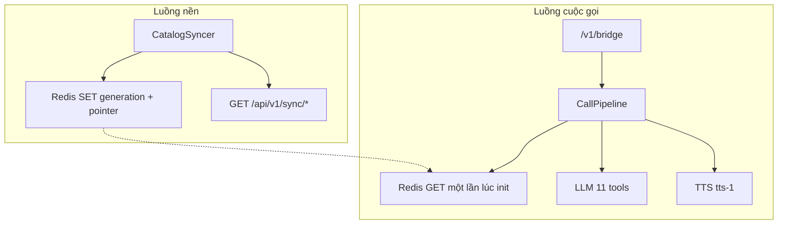

# Pipeline v2 — kế hoạch build theo dõi từng bước

**Spec:** [new_pipeline.md](../new_pipeline.md) §13  
**Phạm vi:** Redis cache + sync nền, snapshot isolation, đóng cuộc gọi sau câu chốt, menu phím DTMF, keypad frontend  
**Thứ tự:** 7 bước spec §13.2, mỗi việc đủ nhỏ để theo dõi từng commit  
**Không đụng:** STT / TTS / resample

Audio cascade (STT / LLM / TTS, barge-in, resample) **giữ nguyên**. Frontend kiến trúc giữ nguyên; v2 chỉ thêm keypad 3 nút.

---

## Tổng quan kiến trúc

Hai luồng không chia sẻ lock. Cuộc gọi không chờ HTTP danh mục (trừ POST chốt đơn).

**Thứ tự triển khai**

- Bước 1–3 không chạm cuộc gọi — deploy sớm được.
- Bước 4 mới đọc cache trên hot path.
- Bước 6 xong rồi mới keypad (bước 7).

---

## Quyết định khi spec lệch

| Chủ đề                           | Quyết định                                                                                                                                           |
| -------------------------------- | ---------------------------------------------------------------------------------------------------------------------------------------------------- |
| `REDIS_URL`                      | **Mặc định trống** → không cache, đúng v1. Spec ghi default `redis://…`; ta opt-in bằng env để `python app.py` không phụ thuộc Docker Redis.         |
| Phím sau khi đã tạo đơn          | Theo §7.1.8 + §14: phím là tín hiệu ý định, **không** bỏ. Một dòng ở §13.2 nói “bị bỏ” — bỏ dòng đó.                                                 |
| Endpoint NestJS `/api/v1/sync/*` | Nằm ở `restaurant-backend`, **không** trong plan này. Syncer gặp 404 → `degraded=True`, cache chỉ write-through. Làm Nest sau khi AI Bridge đã chạy. |
| Test                             | `fakeredis` / fake in-memory + `httpx.MockTransport`. Không Redis thật, không mạng, không `sleep` dài.                                               |

---

## Checklist theo dõi

### Bước 0 — Config

- [ ] Thêm biến §12 vào `config.py` + `.env.example`; `REDIS_URL` default trống
- [ ] Thêm `redis` và `fakeredis` vào `requirements.txt`

### Bước 1 — CatalogCache

- [ ] Tạo `cache/__init__.py` + `CatalogCache` (key layout, connect/aclose)
- [ ] Implement `swap_generation`: INCR, pipeline SET+TTL, rồi lật pointer
- [ ] Implement get/put restaurant+menu, `get_version`, `stats`; JSON lỗi trả `None`
- [ ] Viết `tests/test_catalog_cache.py` (swap, snapshot gen cũ, write-through, JSON hỏng)

### Bước 2 — CatalogSyncer

- [ ] Tạo `sync/models.py`: `SyncPayload`, parse + lọc active, normalize hotline, unwrap `data`
- [ ] Implement `CatalogSyncer`: `warm_once`, `run_forever`, 404 degrade, backoff, lock, `CancelledError`
- [ ] Viết `tests/test_sync_poller.py` với `MockTransport` (skip ghi, swap, 404, backoff, cancel)

### Bước 3 — Lifespan + health

- [ ] Gắn lifespan trong `bridge/server.py`: cache/syncer inject, `warm_once` không crash startup
- [ ] Mở rộng `GET /health` (block cache) và `POST /internal/sync/refresh`
- [ ] Test `REDIS_URL` trống/sai và `SYNC_ENABLED=false`: app lên, hành vi v1

### Bước 4 — Đọc cache trên cuộc gọi

- [ ] Đổi `_load_catalog` 3 bậc + giữ `cache_generation` trên `CallSession`
- [ ] `list_menu` / `search_menu` đọc cache trước, miss thì HTTP + write-through
- [ ] Test cache hit/miss + snapshot isolation session; chạy lại test session/booking/order cũ

### Bước 5 — Grace hangup

- [ ] `OutboundGate` đếm `bytes_sent` / `first_frame_at` + `remaining_playback_seconds`
- [ ] Hangup sau câu chốt (`call.end` + grace + close 1000); hủy khi `speech_started`; POST lỗi không cúp
- [ ] Viết `tests/test_call_end.py` (grace, hủy cúp, không cúp khi lỗi POST)

### Bước 6 — Menu phím DTMF (server)

- [ ] Thêm `EVENT_DTMF` / `CALL_END`, `DtmfDigit`, `SERVICE_BY_DIGIT` vào `protocol.py`
- [ ] `SERVICE_MENU_VI` / `EN` + `ensure_intent_greeting` + `build_system_prompt(service_choice)`; sửa test greeting cũ
- [ ] `on_dtmf`: barge-in, debounce, `apply_service_choice`, phím sai, timeout sau finish greeting
- [ ] Viết `tests/test_dtmf.py` đúng checklist §14 (kể phím sau `booking_created`)

### Bước 7 — Keypad frontend

- [ ] `EVENT_DTMF` + `sendDtmf` trong `protocol.ts` và `bridge.ts`
- [ ] Keypad 3 nút HTML/CSS/`main.ts`: interrupt local, `aria-pressed`, phím tắt bỏ qua input
- [ ] Verify browser: ấn 1/2/3 khi đang greeting → im ngay, đúng nhánh; gõ SĐT không bắn DTMF

---

## Bước 0 — Config (không đụng runtime)

Thêm field §12 vào `[config.py](../config.py)`, `[.env.example](../.env.example)`, `[requirements.txt](../requirements.txt)`.

**Dependencies**

- `redis>=5.0.0`
- `fakeredis>=2.0.0`

**Field config**

| Field                       | Default / giá trị |
| --------------------------- | ----------------- |
| `redis_url`                 | `""`              |
| `redis_namespace`           | `aibridge`        |
| `sync_enabled`              | `true`            |
| `sync_poll_seconds`         | `300`             |
| `sync_timeout`              | `10`              |
| `sync_api_base`             | (env)             |
| `sync_max_backoff_seconds`  | `2400`            |
| `cache_generation_ttl`      | `10800`           |
| `cache_ttl_seconds`         | `600`             |
| `call_end_grace_ms`         | `300`             |
| `dtmf_menu_timeout_seconds` | `7`               |
| `dtmf_debounce_ms`          | `500`             |
| `dtmf_max_invalid`          | `2`               |

`sync_enabled=true` nhưng `redis_url` trống → không tạo cache/syncer, hành vi v1.

---

## Bước 1 — CatalogCache, chưa nối server

File mới: `[cache/redis_store.py](../cache/redis_store.py)`.

**Layout key** (spec §5.5)

- `aibridge:catalog:generation`
- `pointer`
- `gN:hotline:…`
- `gN:menu:…`

Parse ra `Restaurant` / `MenuItem` frozen có sẵn (`[booking/models.py](../booking/models.py)`, `[order/models.py](../order/models.py)`).

**API**

- `get_restaurant`, `get_menu`
- `put_restaurant`, `put_menu` (write-through TTL ngắn)
- `swap_generation`: INCR → pipeline SET+TTL → **rồi mới** lật pointer
- `get_version`, `stats`

Reader: GET pointer → đọc generation đó. Session sau này giữ `cache_generation` (bước 4).

**Test** `[tests/test_catalog_cache.py](../tests/test_catalog_cache.py)`

- swap + TTL + pointer
- reader generation cũ còn đủ sau swap
- JSON lỗi → `None`
- write-through không phá generation

---

## Bước 2 — CatalogSyncer, chưa nối server

`[sync/models.py](../sync/models.py)`: parse `/api/v1/sync/branches`

- unwrap `data`
- lọc branch/restaurant active
- normalize hotline — **cùng luật** `[booking/client.py](../booking/client.py)`

`[sync/poller.py](../sync/poller.py)`

- `warm_once`, `run_forever`
- 404 → degraded + probe lại
- version không đổi → không ghi
- lỗi → backoff nhân đôi có trần
- `CancelledError` phải `raise`
- Leader lock §5.9 (`SET NX EX`) — instance không giành được lock thì skip vòng, log DEBUG

**Test** `[tests/test_sync_poller.py](../tests/test_sync_poller.py)` với `httpx.MockTransport`; inject `sleep`.

---

## Bước 3 — Lifespan + health, vẫn chưa đổi `_load_catalog`

`[bridge/server.py](../bridge/server.py)`: `lifespan` như §5.2

- `warm_once` bọc try/timeout
- Redis connect fail → `catalog_cache=None`
- inject `catalog_cache` / `catalog_syncer` cho test

**HTTP**

- `GET /health` thêm block `cache`, giữ `"status":"ok"`
- `POST /internal/sync/refresh` cùng Bearer token

**Test**

- `REDIS_URL` sai / trống → app lên
- `SYNC_ENABLED=false` → không task nền
- health có `cache.enabled=false`

---

## Bước 4 — Đọc cache trên cuộc gọi (lần đầu chạm hot path)

`[bridge/session.py](../bridge/session.py)` `_load_catalog`

- cache → HTTP `find_by_hotline` + write-through → missing
- `finally` luôn `catalog_ready` + `refresh_system_prompt`
- Redis lỗi nuốt, log WARNING
- Auto-lock 1 chi nhánh
- Copy `list(restaurant.branches)` (đã có trong `apply_restaurant`)
- Giữ `cache_generation` trên session; `get_menu` sau này dùng generation đó (§9.3)

`[order/tools.py](../order/tools.py)`: `list_menu` / `search_menu` cache → HTTP → write-through.

**Test**

- Cache hit không HTTP; miss thì HTTP + put
- Hồi quy: test session/booking/order cũ vẫn pass
- Snapshot: swap cache giữa cuộc gọi → `history[0]` system prompt **không đổi**

---

## Bước 5 — Grace hangup sau câu chốt

`[turn/barge_in.py](../turn/barge_in.py)` `OutboundGate`

- `bytes_sent`, `first_frame_at`
- Helper `remaining_playback_seconds` (32000 byte/s + lead 0.06s + `CALL_END_GRACE_MS`)

Sau `TurnPlayer.finish()`:

- nếu `booking_created` hoặc `order_created` **và** LLM vừa nói câu chốt (không tool đang chờ, không còn slot bắt buộc)
- → gửi `call.end` tùy chọn → sleep grace → `close(1000)`
- Điều kiện **hẹp** — thà không cúp

`on_speech_started` (và sau này `on_dtmf`) hủy `_hangup_task`. POST lỗi → không cúp.

**Test** `[tests/test_call_end.py](../tests/test_call_end.py)`

---

## Bước 6 — Menu phím DTMF (server)

`[bridge/protocol.py](../bridge/protocol.py)`

- `EVENT_DTMF`, `EVENT_CALL_END`
- `VALID_DTMF_DIGITS`, `SERVICE_BY_DIGIT`, `DtmfDigit`
- `parse_text_frame` hiểu `dtmf`; digit `"12"` / rỗng → bỏ

`[bridge/session.py](../bridge/session.py)`

- State: `service_choice`, `awaiting_choice`, `invalid_digit_count`, `last_digit_at`
- `on_dtmf` **không** return sớm khi `awaiting_choice=False`
- DTMF giữa lúc nói = barge-in qua `abort_and_interrupt`
- Debounce 500ms
- Phím 1/2/3 set intent + fulfillment; giữ tên / SĐT / chi nhánh; reset cart nếu order → booking
- Phím sai: đọc lại menu ngắn tối đa `DTMF_MAX_INVALID` lần rồi hỏi lời
- Timeout hẹn **sau** `TurnPlayer.finish()` của greeting (+ remaining playback)
- Transcript khi đang chờ phím **vẫn** chạy

`[llm/stream.py](../llm/stream.py)` + `ensure_intent_greeting`

- `SERVICE_MENU_VI` / `_EN` (disclosure trước, mỗi lựa chọn một câu, số ở cuối)
- `build_system_prompt(..., service_choice=...)` bốn nhánh §7.1.9
- Cập nhật test greeting cũ (`test_session.py`, `test_aggregator.py`)

**Test** `[tests/test_dtmf.py](../tests/test_dtmf.py)` đúng checklist §14.

---

## Bước 7 — Keypad frontend

- `[frontend/src/protocol.ts](../frontend/src/protocol.ts)`, `[frontend/src/bridge.ts](../frontend/src/bridge.ts)`: `sendDtmf`
- `[frontend/index.html](../frontend/index.html)` + CSS: 3 nút, disable khi chưa gọi
- `[frontend/src/main.ts](../frontend/src/main.ts)`
  - `player.interrupt()` **trước** khi gửi
  - log + status
  - `aria-pressed`
  - phím 1/2/3 khi live, **bỏ qua** nếu focus `input` / `textarea`

**Xác nhận trên browser:** ấn nút khi đang nghe greeting → im ngay, AI vào đúng nhánh.

---

## Ngoài phạm vi plan này

- Endpoint NestJS `/api/v1/sync/check-version` và `/branches` (repo `restaurant-backend`)
- Celery / nhiều writer
- Đổi VAD, TTS model, hay wire PCM
- Đơn món thứ hai trong cùng cuộc gọi (`order_created` vẫn scalar)

