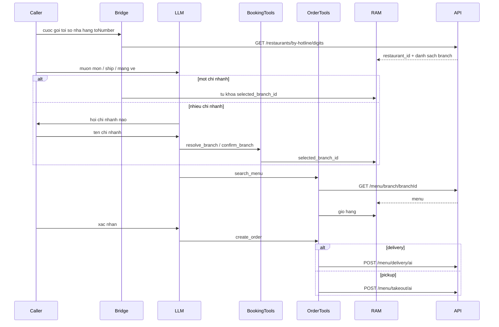

# Sửa order: khóa chi nhánh từ hotline rồi gọi API menu/đơn

Không gọi `PATCH /menu/delivery/{id}/confirm` hay `PATCH /menu/takeout/{id}/confirm`.



## 0. Chi nhánh trước menu/đơn (tái sử dụng booking)

Cuộc gọi đã mang số nhà hàng: `session.init.toNumber`. Catalog **đã có** — không viết API mới:

- [`bridge/session.py`](bridge/session.py) `_load_catalog` gọi [`RestaurantClient.find_by_hotline`](booking/client.py) → `GET /restaurants/by-hotline/{digits}`
- RAM: `restaurant_id`, `branches` (chỉ `status=active`)
- Khóa chi nhánh: tool sẵn có `resolve_branch` / `confirm_branch` trong [`booking/tools.py`](booking/tools.py) → `selected_branch_id`

Việc cần sửa là **bắt buộc** bước này trước khi xem menu / đặt hàng:

- **Một chi nhánh:** tự `select_branch` khi catalog xong (hoặc lúc `_ensure_menu`), không hỏi.
- **Nhiều chi nhánh, chưa khóa:** `search_menu` / `add_to_cart` / `create_order` trả `{ok:false, error:"no_branch"}` kèm `available_branches` (tên + địa chỉ, không UUID miệng). AI **hỏi** khách chi nhánh nào (đọc tên từ catalog), rồi `resolve_branch` với lời họ nói; khớp high → khóa; ambiguous/low → `confirm_branch`.
- **Đã khóa:** mọi GET menu và POST đơn chỉ dùng `session.selected_branch_id` + `session.restaurant_id` từ RAM — LLM không được bịa UUID.
- Đổi chi nhánh giữa cuộc gọi: xóa `menu`, `menu_ready=False`, xóa `cart`.

Prompt hiện tại chờ khách tự nêu chi nhánh. Đổi: khi intent đặt món và chưa khóa, **hỏi trước** (một câu, đọc tên chi nhánh đang hoạt động). Không GET menu khi chưa có `branch_id`.

## Gap hiện tại

[`order/client.py`](order/client.py) đang gọi path giả định:

- `GET /restaurants/{id}/menu` rồi fallback `GET /menus`
- `POST /orders/ai` rồi fallback `POST /orders`

API thật:

- `GET /menu/branch/{branchId}` — bắt buộc `branchId`
- `POST /menu/delivery/ai` — body `CreateDeliveryBookingDto`
- `POST /menu/takeout/ai` — body `CreateTakeoutBookingDto`

`OrderItemDto` chỉ có `menu_item_id` + `quantity` (không có note từng dòng). Delivery còn bắt buộc `booking_date`, `booking_time`, `delivery_address`, `delivery_fee`, `estimated_delivery_time`.

## 1. HTTP client — [`order/client.py`](order/client.py)

**GET menu**

- Một path: `GET {base}/menu/branch/{branch_id}`
- Thiếu `branch_id` → `MenuResult(ok=False, error="no_branch")`, không HTTP
- Giữ `unwrap_data` vì các endpoint khác bọc `{ success, data }`
- Bỏ vòng fallback `/restaurants/.../menu` và `/menus`

**Parse món** — schema Swagger `MenuItem` trống; map theo `CreateMenuItemDto` + id NestJS:

- `id` hoặc `menu_item_id`
- `name`, `price`, `description`
- `available`: `status` in `{available}` (còn `unavailable` / `sold_out` thì false); nếu có `quantity_available == 0` thì cũng false; vẫn chấp nhận boolean `available` cũ
- Bỏ qua món thiếu `id` hoặc `name`

**POST tạo đơn** — chọn path theo `fulfillment` trong body tool, không fallback:

- `delivery` → `POST /menu/delivery/ai`
- `pickup` → `POST /menu/takeout/ai`

Body chung (id từ RAM, không tin LLM):

```json
{
  "restaurant_id": "...",
  "branch_id": "...",
  "customer_name": "...",
  "customer_phone": "0901234567",
  "booking_date": "2026-09-04",
  "booking_time": "18:30",
  "items": [{ "menu_item_id": "...", "quantity": 2 }],
  "note": "ít cay; thêm tương"
}
```

Thêm khi delivery:

- `delivery_address` (bắt buộc)
- `delivery_phone` = `customer_phone` nếu khách không nêu số khác
- `delivery_fee`: `0` (AI không tính phí ship; field API bắt buộc)
- `estimated_delivery_time`: cùng `booking_time`

Ghi chú từng dòng giỏ (`CartLine.note`) gộp vào `note` đơn, vì API không nhận note theo item.

## 2. Tool + session — [`order/tools.py`](order/tools.py), [`bridge/session.py`](bridge/session.py)

Giữ tên tool LLM (`search_menu`, `add_to_cart`, `create_order`, …). Đổi điều kiện và payload.

**Menu theo chi nhánh đã khóa**

- `_ensure_menu` / `create_order`: bắt buộc `selected_branch_id`. Một chi nhánh active → tự khóa rồi GET. Nhiều chi nhánh chưa khóa → `{ok:false, error:"no_branch", available_branches:[...]}` — không gọi HTTP menu/đơn.
- `get_menu` URL chỉ dùng `branch_id` đã khóa: `GET /menu/branch/{branchId}`.
- `select_branch`: nếu id đổi so với trước, reset menu + cart.

**`create_order`**

- Bắt buộc `booking_date` (`YYYY-MM-DD`) và `booking_time` (`HH:MM`) giống [`booking/tools.py`](booking/tools.py) (`normalize_booking_time` + regex ngày).
- Đổi schema tool: bỏ `ready_time` tùy chọn; thêm `booking_date` + `booking_time` required.
- Vẫn lấy `restaurant_id`, `branch_id`, `cart`, `fulfillment`, `delivery_address` từ RAM.
- Pickup không gửi field delivery.
- Idempotent `order_created` giữ nguyên.

## 3. Prompt — [`llm/stream.py`](llm/stream.py)

Thứ tự đặt món:

1. Nếu chưa chọn chi nhánh và có nhiều nơi: hỏi khách chi nhánh nào, đọc tên/địa chỉ từ catalog hotline. Gọi `resolve_branch` / `confirm_branch`. Không `search_menu` trước khi khóa.
2. Một chi nhánh: không hỏi, dùng chi nhánh đó.
3. Sau khi khóa: `search_menu` → giỏ → giao/mang về → tên, SĐT khách, ngày giờ → đọc lại → `create_order`.
4. Không đọc `delivery_fee` hay UUID. COD giữ nguyên.

## 4. Docs — [`documents/order-api-contract.md`](documents/order-api-contract.md), [`documents/ai-pipeline.md`](documents/ai-pipeline.md)

Viết lại hợp đồng cho khớp Swagger (path, field bắt buộc, không fallback, không PATCH confirm). Cập nhật §10 pipeline: `create_order` → `/menu/delivery/ai` hoặc `/menu/takeout/ai`.

## 5. Tests

[`tests/test_order_client.py`](tests/test_order_client.py)

- GET chỉ `/menu/branch/{id}`; 404/network không fallback path cũ
- thiếu branch_id không HTTP
- parse `status`/`quantity_available`
- POST delivery body đúng DTO (`delivery_fee=0`, `estimated_delivery_time`, items không có note)
- POST pickup → `/menu/takeout/ai`, không có `delivery_address`

[`tests/test_order_tools.py`](tests/test_order_tools.py)

- `search_menu` khi chưa khóa + nhiều chi nhánh → `no_branch` + `available_branches`, không HTTP menu
- một chi nhánh → tự khóa rồi `GET /menu/branch/{id}`
- `create_order` gửi `booking_date`/`booking_time` và `branch_id` RAM; note dòng gộp vào `note`
- thiếu ngày/giờ → `missing_fields`

[`tests/test_order_session.py`](tests/test_order_session.py)

- `menu_lookups` mang `branch_id` đã khóa (sửa kỳ vọng `("rest-1", "")`)
- Hotline nạp catalog; sau `confirm_branch` mới search/create dùng đúng id đó

Fake [`tests/fakes.py`](tests/fakes.py) giữ `get_menu`/`create_order`; không đổi chữ ký trừ khi cần.

## Việc không làm

- Không gọi PATCH confirm / trừ kho
- Không đổi wire WebSocket, STT/TTS; không thêm endpoint liệt kê chi nhánh (dùng hotline + `resolve_branch` sẵn có)
- Không tính phí ship thật; gửi `0`
